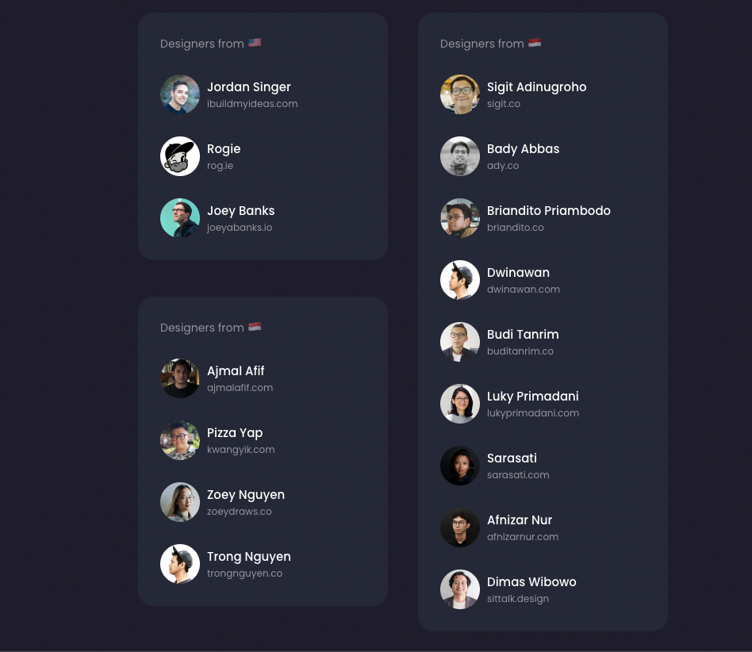
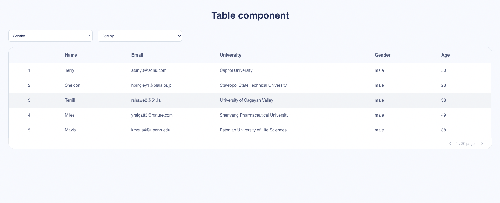

# Hetiware Frontend Developer

At Hetiware, two tests were conducted to evaluate my web development skills. The tests focused on two different aspects:

- Creating responsive cards using HTML and CSS.
- Implementing an interactive table in TypeScript using a React application.

Below, I will detail the most important points of each test and the technologies used.

## Responsive Cards

In this test, I was tasked with creating responsive cards using HTML and CSS. The main objective was to demonstrate my skills in developing adaptive interfaces that look great on different devices and screen sizes natively.

Technologies

- **HTML**: HTML was used to structure the content of the cards and establish proper semantics.
- **CSS**: CSS styles were applied to define the visual design of the cards, including colors, typography, margins, padding, etc.
- **Responsive**: Responsive design techniques, such as media queries, were implemented to adapt the cards to different resolutions and screen sizes.

## Installation and running the Project

- Clone the repository using the git clone command followed by the project's URL.
- It is recommended to have the [Live Server](https://marketplace.visualstudio.com/items?itemName=ritwickdey.LiveServer) extension installed in Visual Studio Code.

```sh
cd cards-component
code .
```

- Open with Live Server in your browser to see the result.
- You can also visit [here](https://hetiware-component-cards.vercel.app/) to see the live project.

## Project Preview



## Dynamic Table

In this second test, I was asked to implement an interactive table using TypeScript and the React library. The main objective of developing the table was to assess my JavaScript skills and my ability to implement solutions, the task involved consuming data from a dummy service and allowing sorting by age in ascending and descending order, as well as selecting the male or female gender.

## Tecnologías

- **NextJS**: It was chosen for its ability to pre-render pages, improving loading speed and user experience. It also comes with an integrated router and code optimization, making it suitable for large and complex projects.
- **Tailwindcss**: It was used for the layout and styling of the project. Its wide variety of reusable classes facilitated the creation of responsive and customized designs.

## Documentation of Used Technologies

- [NextJS](https://nextjs.org/docs)
- [Tailwindcss](https://tailwindcss.com/docs)

## Project Functionality

The development of the table is highly innovative as it is a completely dynamic table that uses backend keys to automatically generate rows. This allows the frontend to generate the table with just a single code snippet in a matter of seconds.
 
## Installation and running the Project

- Required [Node.js](https://nodejs.org/) v10+.
- Clone the repository using the git clone command followed by the project's URL.
- Guide to install the project dependencies and run it.

```sh
cd table-component
yarn
yarn dev
```

- Open [http://localhost:3000](http://localhost:3000) in your browser to see the result.
- You can also visit [here](https://hetiware-component-table.vercel.app/) to see the live project.

## Project Preview


